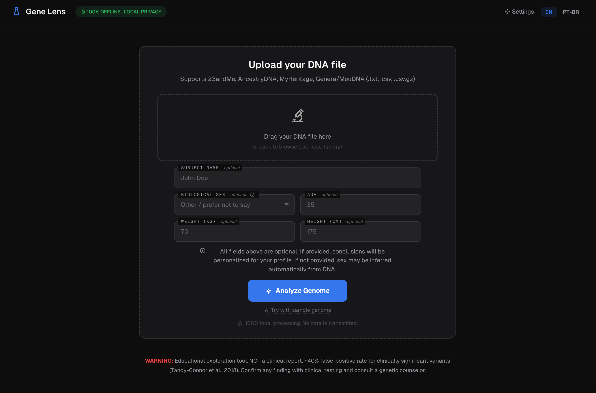
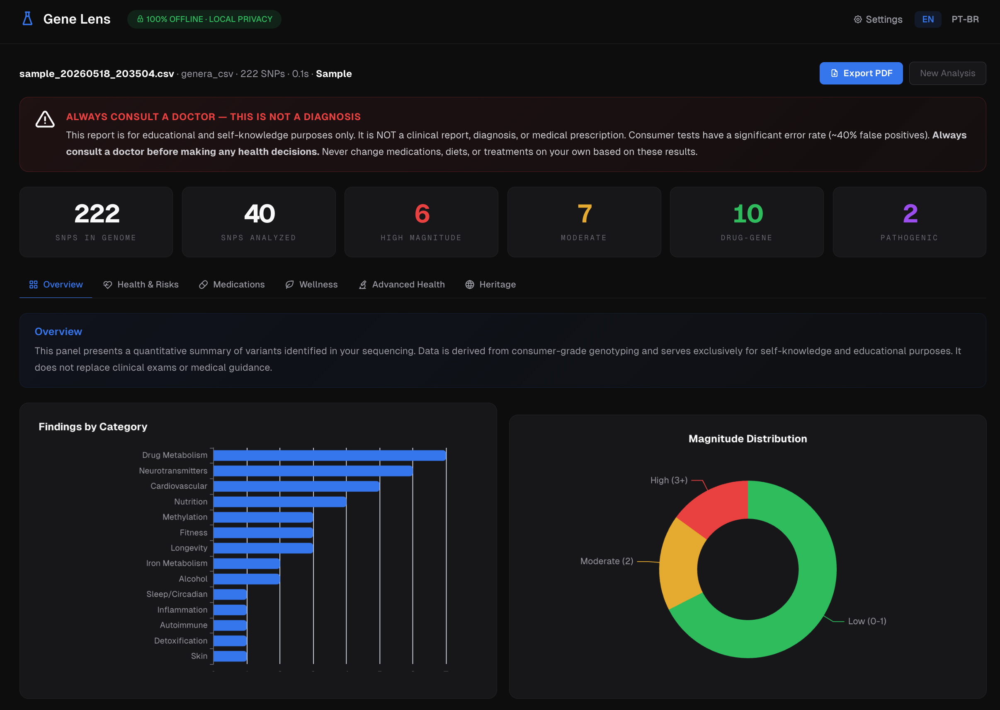
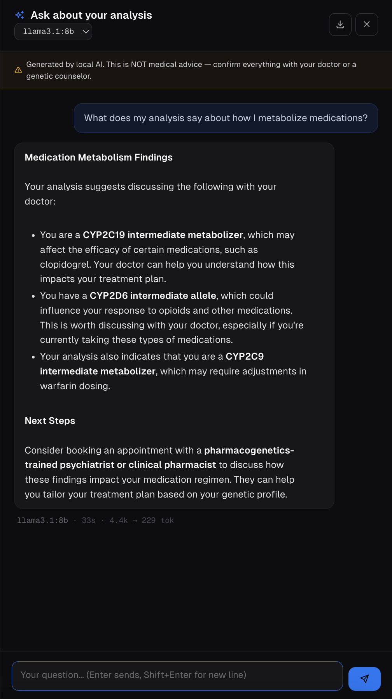
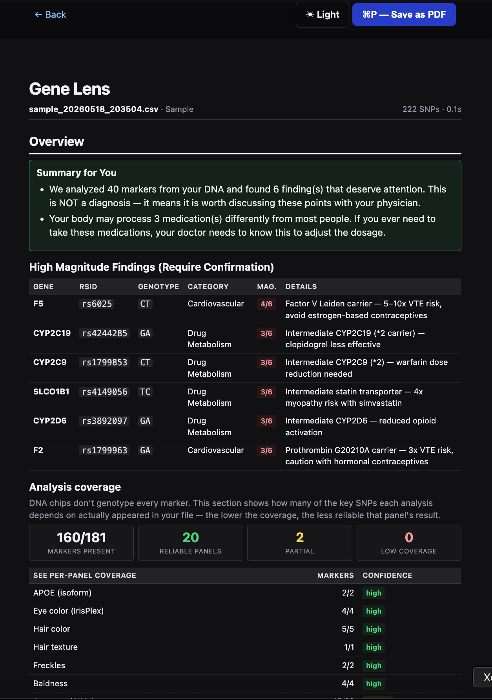

# Gene Lens

> Read this in [Portuguese (PT-BR)](README.pt-BR.md).

[](LICENSE)
[](https://python.org)
[](https://github.com/dimas-amendes/gene-lens/actions/workflows/ci.yml)
[](#privacy-architecture)

**Local-first genetic exploration dashboard.** Designed for offline analysis of raw DNA data from consumer genotyping services (23andMe, AncestryDNA, MyHeritage, Genera/MeuDNA) against public reference databases (ClinVar, PharmGKB) — blocks standard Python network access during analysis and processes everything on your machine.

Built with Flask, Apache ECharts, Halfmoon CSS, and Geist font. Optional local AI via Ollama and neural translation via Argos Translate.

---

## Why I Built This

There's a long line of inherited illness in my family — conditions that have shown up across multiple generations, with a documented genetic component. Living with that meant always carrying a quiet question: how much of my own health was already written, and how much of it was just coincidence?

When I stumbled on a [post about exploring raw 23andMe data with public databases](https://www.youtube.com/@nicksaraev), something clicked. I had the file. The reference databases (ClinVar, PharmGKB) were free. I just needed a tool that wouldn't ship my DNA to some cloud service to be processed.

So I built one. What surprised me wasn't the tech — it was the overlap. Several of the variants the tool flagged matched conditions that had already been confirmed by my doctors years before, sometimes for things I hadn't even thought to mention. Other findings opened questions I brought to my next appointment. The point was never to diagnose myself — it was to stop being a passenger in conversations about my own body.

If you have a similar family history, or you're just curious, this tool exists for that. It runs entirely on your machine, your data never leaves it, and the findings are framed as starting points for conversations with a real professional — not answers.

---

## What This Project Is / Is Not

| This project IS | This project IS NOT |
|---|---|
| An educational exploration tool for consumer DNA raw data | A diagnostic tool or medical device (SaMD) |
| A way to generate discussion topics for your physician | A replacement for clinical genetic testing |
| A starting point for personal genomic curiosity | A confirmatory test — a negative result does not rule out risk |
| Open-source software with strong ethical disclaimers | A product that guarantees clinical accuracy |

---

> [!WARNING]
> **THIS SOFTWARE IS NOT A MEDICAL DEVICE (SaMD). IT IS NOT INTENDED TO DIAGNOSE, TREAT, CURE, OR PREVENT ANY DISEASE. FOR EDUCATIONAL AND SELF-KNOWLEDGE PURPOSES ONLY.**
>
> Consumer genotyping chips (used by 23andMe, Genera, AncestryDNA, etc.) have an approximately **40% false positive rate** for clinically significant variants (Tandy-Connor et al., *Genetics in Medicine*, 2018). This means nearly half of "pathogenic" findings from consumer tests are **wrong** when confirmed by clinical-grade sequencing.
>
> **NEVER change medications, diets, or treatments based on these results without consulting a physician.** The author/maintainer assumes **NO LIABILITY** for clinical decisions, psychological distress (anxiety induced by false positives), or any damages caused by the use of this software.
>
> For professional genetic counseling: [findageneticcounselor.nsgc.org](https://findageneticcounselor.nsgc.org)

---

## Features

- **Local-first privacy** — Standard Python network access is blocked (`socket` monkey-patched) during analysis. Designed so DNA data does not leave your machine. Uploaded files are securely overwritten after processing.
- **Interactive dashboard** — Dark-themed web UI with ECharts visualizations (charts, ancestry maps, variant tables), served locally on `127.0.0.1`. Zero CDN dependencies.
- **Pharmacogenomics** — Drug-gene interactions from PharmGKB/CPIC with evidence levels 1A/1B/2A/2B and reference-based annotation per gene.
- **Disease variant exploration** — Variant classification from ClinVar (pathogenic, likely pathogenic, risk factors, protective) with gold-star confidence ratings.
- **Sex-aware clinical routing** — Intelligent rendering of hereditary condition findings (HBOC/BRCA, Lynch, Prostate, Thrombophilia, Hemochromatosis, FH, Alpha-1 AT) conditioned on biological sex, matching the reporting approach of clinical-grade laboratories. Focuses on highly actionable monogenic conditions rather than noisy polygenic traits.
- **12 wellness panels** — Nutrition, fitness, skin, aging, sensory perception, sleep/chronobiology, longevity, mental health, food sensitivities, thyroid, eye health, and bone health.
- **Ancestry estimation** — Continental ancestry from 22 Ancestry Informative Markers (AIMs) with interactive world map.
- **Phenotype prediction** — Eye color, hair color, hair texture, freckling, androgenetic alopecia (HIrisPlex model + GWAS loci). Each prediction shows its genetic basis (contributing SNPs).
- **Family planning exploration** — Carrier-status exploration, gestational risk factors (MTHFR, F5, F2), X-linked conditions, dominant variant transmission.
- **Bilingual** — Full Portuguese (PT-BR) and English interface with neural medical translation (Argos Translate).
- **Humanized + technical views** — Plain-language summaries for self-exploration alongside detailed technical appendix for physician review.
- **Local AI interpretation** — Optional report interpretation via Ollama (Llama, Gemma, etc.).

---

## Screenshots



*Upload your DNA file. Profile fields are all optional — sex can be inferred from the Y chromosome if you'd rather not specify.*



*After analysis: top-of-page KPI strip plus six tabs covering Health & Risks, Medications, Wellness, Advanced Health, and Heritage. Charts use a single-hue palette so the data shape carries the signal, not the colors.*



*Local AI (Ollama) discussing the user's medication metabolism. Replies are grounded in the analysis, never prescriptive, and always point back to the doctor. Footer shows the model, wall-clock time, and token count — proof that nothing leaves the machine.*



*The `/report` view: print-first layout with `⌘P → Save as PDF` so you can hand a tidy document to your physician.*

---

## Quick Start

### Prerequisites

- **Python 3.10, 3.11, or 3.12** (3.13+ may work but isn't covered by CI)
- ~500 MB disk space for reference databases

### 1. Clone and install

```bash
git clone https://github.com/dimas-amendes/gene-lens.git
cd gene-lens

# Create an isolated virtual environment (required on modern macOS/Linux
# because system Python refuses global installs — PEP 668).
python3 -m venv .venv
source .venv/bin/activate          # Windows: .venv\Scripts\activate

pip install -r requirements.txt
```

> **Why a venv?** On macOS (Homebrew Python) and most Linux distros, `pip install` outside a venv fails with `externally-managed-environment`. Using `.venv` isolates the project's dependencies from your system Python.
>
> To leave the venv later: `deactivate`. To re-enter on a new shell session: `source .venv/bin/activate`.

### 2. Download reference databases (one-time, requires internet)

```bash
python main.py download
```

This downloads:
- **ClinVar** (~120 MB compressed) — free, no registration ([NCBI FTP](https://ftp.ncbi.nlm.nih.gov/pub/clinvar/))
- **PharmGKB** — requires free account at [pharmgkb.org](https://www.pharmgkb.org/downloads). Download "Clinical Annotations" ZIP and extract to `data/`.

> **This is the only step that requires internet.** After database download, all analysis is designed for local-first, offline execution.

### 3. Start the dashboard

```bash
python run.py                    # Simplest — double-click on Windows
python main.py web               # Via CLI
python main.py web --port 8080   # Custom port
```

Open [http://127.0.0.1:5000](http://127.0.0.1:5000) in your browser.

### 4. Test with sample data

A synthetic genome file is included for testing (no real DNA needed):

```bash
# Via dashboard: upload sample/sample_genome.csv in the web UI
# Via CLI:
python main.py analyze sample/sample_genome.csv --name "Sample"
```

### Optional: Neural translation (PT-BR)

```bash
pip install argostranslate
python main.py install-translator-model   # one-time ~100 MB download of the en->pt model
```

Only required if you want analyses in Portuguese. English analyses don't need it.

### Optional: Local AI interpretation

```bash
# Install Ollama: https://ollama.ai
ollama pull llama3.1:8b
python main.py analyze input/your_dna.txt --ai
```

---

## How Findings Are Prioritized

The system uses a multi-layered evidence model to separate signal from noise:

| Layer | Source | What It Means |
|-------|--------|--------------|
| **ClinVar Review Status** (0-4 stars) | NCBI expert review | 4 stars = practice guideline; 1 star = single submitter; 0 = no assertion criteria |
| **Clinical Significance** | ClinVar classification | Pathogenic > Likely Pathogenic > Risk Factor > Uncertain > Benign |
| **PharmGKB/CPIC Evidence** | Clinical trials | Level 1A/1B = CPIC dosing guideline; Level 2A/2B = documented but no formal guideline |
| **Hereditary Condition Matrix** | Curated per-condition rules | Only monogenic, high-actionability conditions with sex-aware routing |

**All notable findings require clinical confirmation.** A finding flagged here is a reason to talk to your doctor, not a diagnosis.

---

## Known Limitations

1. **Consumer genotyping is not clinical sequencing.** Microarray chips test ~600K-2M pre-selected SNPs; clinical whole-exome/genome sequencing covers 20K+ genes comprehensively.
2. **Incomplete coverage of rare variants.** Most pathogenic mutations in genes like BRCA1/2 are private to families — chips may miss them entirely.
3. **Common diseases are polygenic and multifactorial.** This tool does not calculate Polygenic Risk Scores (PRS). Conditions like diabetes, hypertension, and depression involve hundreds of genes plus environment.
4. **Ancestry and phenotype are estimates.** Based on limited markers (~22 AIMs, ~16 pigmentation SNPs) and population-frequency models. Real ancestry is far more complex.
5. **Absence of a variant does not exclude risk.** The file may simply not contain the relevant SNP. A "clean" report does not mean zero genetic risk.

---

## Project Structure

```
genetic-health-analyzer/
├── run.py                  # Quick launcher (double-click)
├── main.py                 # CLI entry point
├── dashboard.py            # Flask web dashboard
├── download_databases.py   # Database downloader (only network access)
├── config.py               # Configuration and paths
├── requirements.txt        # Python dependencies
├── LICENSE                 # MIT
│
├── src/
│   ├── analyzer.py         # Lifestyle & disease analysis engine
│   ├── ancestry.py         # Continental ancestry (22 AIMs)
│   ├── consent.py          # Terms acceptance system
│   ├── databases.py        # ClinVar & PharmGKB loaders
│   ├── family_planning.py  # Carrier-status & gestational exploration
│   ├── hereditary_conditions.py  # Sex-aware clinical routing matrix
│   ├── i18n.py             # Internationalization (PT-BR / EN)
│   ├── local_ai.py         # Ollama integration (optional)
│   ├── parsers.py          # DNA file format parsers
│   ├── phenotype.py        # Appearance prediction (HIrisPlex + GWAS)
│   ├── privacy.py          # NetworkBlocker, secure delete
│   ├── reports.py          # Markdown report generation
│   ├── sex_inference.py    # Biological sex inference from Y chromosome
│   ├── snp_database.py     # Curated SNP database (~200 variants)
│   ├── translations.py     # Medical term translations
│   ├── translator.py       # Neural translation pipeline
│   └── wellness_panels.py  # 12 wellness panels (~80 SNPs)
│
├── templates/              # Jinja2 HTML templates
├── static/                 # Local assets (zero CDN)
├── sample/                 # Synthetic test data
├── data/                   # Reference databases (gitignored)
├── input/                  # User DNA files (gitignored)
└── output/                 # Generated reports (gitignored)
```

## How to get your raw DNA file

Gene Lens needs the raw genotyping file your testing service generated — not the polished report they show you in their app. Every major consumer service lets you download this for free, but the option is buried in account settings.

| Service | Where to find it | Wait time |
|---|---|:---:|
| **23andMe** | Account menu → **Browse Raw Data** → **Download Raw Data**. Re-enter your password to confirm. | Immediate |
| **AncestryDNA** | **Settings** → **DNA** tab → **Download Raw DNA Data**. Confirm via email link. | ~24 h |
| **MyHeritage** | **Settings** → **Manage DNA Kits** → ⋯ menu → **Download Raw Data**. | ~24 h |
| **Genera / MeuDNA** | Resultados → **Exportar dados brutos**. | Immediate |

**Important:**

- The file usually arrives as a `.zip`. **Unzip it** before uploading — Gene Lens reads the inner `.txt` or `.csv`, not the archive. (Files already gzipped as `.gz` are read transparently.)
- The download is your **private genetic data**. Don't email it, paste it into chat tools, or upload it to other services. Gene Lens never sends it anywhere — keep it that way.
- Some services email a confirmation link or require 2FA before releasing the file. That's the service protecting you; follow their flow.
- If your service isn't listed, the **Generic** format below works for any TSV/CSV that exposes RSID, Chromosome, Position, and Genotype columns.

Drop the unzipped file into the dashboard (drag-and-drop on `/`) or into `input/` and run `python main.py analyze input/your_dna.txt`.

## Supported Formats

| Service | Format | Auto-detected |
|---------|--------|:---:|
| 23andMe | 4-column TSV (rsid, chr, pos, genotype) | Yes |
| AncestryDNA | 5-column TSV (rsid, chr, pos, allele1, allele2) | Yes |
| MyHeritage | CSV with RSID, CHROMOSOME, POSITION, RESULT | Yes |
| Genera / MeuDNA | CSV with RSID, CHROMOSOME, POSITION, RESULT | Yes |
| Generic | TSV or CSV with identifiable RSID, Chromosome, Position, and Genotype/Result columns | Yes |

Compressed files (`.gz`) are supported transparently.

---

## Privacy Architecture

Designed for local-first, offline analysis after the initial database download.

**Protects against:**
- Accidental cloud upload during analysis (socket blocked)
- CDN data leakage (all assets served locally)
- Telemetry or tracking (zero external requests)
- Standard Python network calls during processing

**Does not protect against:**
- Malware already present on the host machine
- Cloud-synced folders (Dropbox, OneDrive, iCloud) — ensure your working directory is not synced
- System backups that may capture genetic files
- External subprocesses that bypass Python's socket layer

**Technical measures:**
1. **Network Blocker** — `socket.socket` and `socket.getaddrinfo` are monkey-patched during analysis. Standard Python network calls raise `ConnectionError`.
2. **Secure Delete** — Uploaded DNA files are overwritten with random data before deletion.
3. **No Metadata** — Reports contain no system-identifying information (no hostname, username, or file paths).
4. **Local Only** — Flask binds exclusively to `127.0.0.1`. Not accessible from other machines.
5. **No Telemetry** — Zero analytics, tracking, or external requests.

Verify your setup: `python main.py privacy-check`

---

## Data Attribution

- **ClinVar** — NCBI, National Library of Medicine. Landrum MJ, et al. *Nucleic Acids Research*, 2020. [ncbi.nlm.nih.gov/clinvar](https://www.ncbi.nlm.nih.gov/clinvar/)
- **PharmGKB** — Stanford University, NIH/NIGMS. Whirl-Carrillo M, et al. *Clinical Pharmacology & Therapeutics*, 2021. [pharmgkb.org](https://www.pharmgkb.org/)
- **CPIC** — Clinical Pharmacogenetics Implementation Consortium. Relling MV, Klein TE. *Clinical Pharmacology & Therapeutics*, 2011. [cpicpgx.org](https://cpicpgx.org/)
- **HIrisPlex** — Walsh S, et al. *Forensic Science International: Genetics*, 2013.

---

## License

Licensed under the **MIT License**.

You may freely use, copy, modify, merge, publish, distribute, sublicense, and sell copies of this software — including for commercial purposes — provided that the copyright notice and permission notice are retained.

See [LICENSE](LICENSE) for the full text.

---

## Contributing

Contributions are welcome!

1. Fork the repository
2. Create a feature branch (`git checkout -b feature/my-feature`)
3. **Ensure no personal/genetic data is included** in commits
4. Submit a Pull Request

By contributing, you agree that your contributions will be licensed under the MIT License.

---

## Acknowledgments

Inspired by the bioinformatics exploration approach demonstrated by [Nick Saraev](https://www.youtube.com/@nicksaraev). While the original concept provided the spark, this project was entirely rewritten with a focus on local-first execution, permissive MIT licensing, strict ethical disclaimers, sex-aware clinical routing, and accessibility for non-technical users.

---

*Built with care for privacy and scientific rigor. Your DNA is yours alone.*
